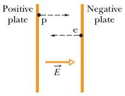

# Equations

```{=tex}

The electric field \( \va{E} \) is defined as the electromagnetic force (as given by Coulomb's Law) experienced by a test particle with a charge of +1 "dropped in" at any given point. In math, with the test charge \(q_0\) 

\begin{equation}
\label{eq:electric-field}
\va{E} = \frac{\va{F}}{q_0}.
\end{equation}

The equation for the electric field \( \va{E} \) caused by a particle with charge \(q\) at a distance \(\va{r}\) is

\begin{equation}
\label{eq:electric-field-point-charge}
\va{E} = \frac{1}{4\pi\varepsilon_0} \frac{q}{r^2} \vu{r}.
\end{equation}

Note that a positive \(q\) causes the electric field to point away, while a negative charge would cause the electric field to point towards it. That's what the \(\vu{r}\) means. The electric field is in the direction of \(r\), where \(r\) is the verctor from \(q\) to wherever you're interested in, so for positive \(q\), it points away from the charge). If you're only interested in the magnitude of \(\va{E}\), you can use

\begin{equation}
\label{eq:electric-field-point-charge-mag}
\va{E} = \frac{1}{4\pi\varepsilon_0} \frac{q}{r^2}.
\end{equation}

Similar equations can be derived for a charged disk. This gives the magnitude of the electric field at a point along the central axis through a uniformly charged disk

\begin{equation}
\label{eq:electric-field-disk}
E = \frac{\sigma}{2\varepsilon_0}\left(1 - \frac{z}{\sqrt{z^2 + R^2}} \right),
\end{equation}

where \(z\) is the distance along the axis from the center of the disk, \(R\) is its radius, and \(\sigma\) is the suface charge density.

Additionally, because the electric field is really just a force, it obeys the \textbf{principle of superposition}. That's a fancy way of saying "you can add electric fields together". 

\begin{equation}
\label{eq:electric-field-superposition}
\va{E} = \va{E_1} + \va{E_2} + \va{E_3} + \dots + \va{E_N}.
\end{equation}

```

# Problems

## Question 1 (Resnick-Halliday, Ch. 22, P1)

Two charged particles are fixed to an x axis: Particle 1 of charge $q_1 = \SI{2.1e8}{\coulomb}$ is at position $x = 20 \si{cm}$ and particle 2 of charge $q_2 = -4.00q_1$ is at position $x=70 \si{cm}$. (a) At what coordinate on the axis (other than at infinity) is the net electric field produced by the two particles equal to zero? (b) What is the zero-field coordinate if the particles are interchanged?

### Solution (a)
```{=tex}

Let's start with the givens

\[ q_1 = \SI{2.1e8}{\coulomb} \]
\[ x_1 = 20 \si{cm} \]

\[ q_2 = -4q_1 \]
\[ x_2 = 70 \si{cm} \]

The question asks us to find the coordinate where \( \va{E} = 0 \). Since we're dealing with point charges, let's start with Eqn. \ref{eq:electric-field-point-charge}.
\[ \va{E} = \frac{1}{4\pi\varepsilon_0} \frac{q}{r^2} \]

The electric field due to \(q_1\), evaluated at some point \(x\), is
\[ \va{E} = \frac{1}{4\pi\varepsilon_0} \frac{q_1}{(x - 20)^2}. \]

And for \(q_2\), also evaluated at some point \(x\), is
\[ \va{E} = \frac{1}{4\pi\varepsilon_0} \frac{q_2}{(x - 70)^2} \]

Note that we're able to leave the 20 cm and the 70 cm, rather than converting them to 0.20 m and 0.70 m, respectively, because later on, all the constants are going to cancel. However, it is \textit{extremely} important to note that this will not work in all cases, and is a bad habit to get into.

Because of the principle of superpositiong (Egn \ref{eq:electric-field-superposition}), you can simply add these two together, and substitute $q_2 = -4q_1$:

\[ \va{E} = \frac{1}{4\pi\varepsilon_0} \left[ \frac{q_1}{(x - 20)^2} + \frac{-4q_1}{(x - 70)^2} \right] \]

The question asks us to find when \( \va{E} = 0 \), so lets substiute

\[ 0 = \frac{1}{4\pi\varepsilon_0} \left[ \frac{q_1}{(x - 20)^2} + \frac{-4q_1}{(x - 70)^2} \right] \]

Now, note that \( \frac{1}{4\pi\varepsilon_0} \) is just a constant. Since the entire thing is equal to 0, we can just divide by teh constant and it goes away.

\[ 0 = \frac{q_1}{(x - 20)^2} - \frac{-4q_1}{(x - 70)^2}  \]

Rerrange

\[ \frac{q_1}{(x - 20)^2} = \frac{-4q_1}{(x - 70)^2} \]

Cancel $q_1$ from both sides. Note that even though they gave us $q_1$ in the problem, we don't actually need it -- it cancels out. This is a good demonstration of why you should always do as much simplification as possible before substituting values. If you'd substituted earlier, that introduces more stuff to write, more room for error, and it might leave you uncertain what to do had the problem not given you $q_1$.


\[ \frac{1}{(x - 20)^2} = \frac{-4}{(x - 70)^2} \]

Cross multiply.
\[ 4(x-20)^2 = (x-70)^2 \]

Distribute and solve.


\[ 4x^2 - 160x + 1600 = x^2 - 140x + 4900 \]
\[ 3x^2 - 20x - 3300 = 0 \]
\[ x = -30 \si{cm} \text{ or } 36.67 \si{cm} \]

Note that the textbook only mentions the -30 cm solution, not the 36.67 one. I can't figure out why, as far as I can tell, both of them should work, but regardless this is a good demonstration of why you try to simplify by hand as much as possible first, before handing it to your calculator. My calculator seems to come up with 36.67 about 80% of the time, and -30 about 20%, which led to quite a bit of confusion. Once you simplify it to a quadratic, however, it becomes clear that there are two solutions, and you can easily find both.
```

### Solution (b)
Part two asks what would happen if the particles were interchanged. This is very similar, simply swap $q_1$ and $q_2$.  

```{=tex}
\[ 0 = -\frac{4q_1}{(x - 20)^2} + \frac{q_1}{(x - 70)^2} \]

\[ \frac{4}{(x - 20)^2} = \frac{1}{(x - 70)^2} \]

Cross multiply.
\[ 4(x-70)^2 = (x-20)^2 \]

Distribute and solve.


\[ 4(x^2 - 140x + 4900) = x^2 - 40x + 400 \]
\[ 4x^2 - 560x + 19600 = x^2 - 40x + 400 \]
\[ 3x^2 - 520x + 19200 = 0 \]
\[ x = 120 \si{cm} \text{ or } 53.33 \si{cm} \]

Once again, the textbook only provides 120 \si{cm} as a solution, I'm not sure why.

```

## Question 2 (Resnick-Halliday, Ch. 22, P3)

At what distance along the central perpendicular axis of a uniformly charged plastic disk of radius 0.600 m is the magnitude of the electric field equal to 25% of the magnitude of the field at the center of the surface of the disk? 

### Solution

This is basically a textbook (haha) application of Eqn. \ref{eq:electric-field-disk}

```{=tex}

\[ E = \frac{\sigma}{2\varepsilon_0}\left(1 - \frac{z}{\sqrt{z^2 + R^2}} \right) \]

We're trying to find a \(z\) value such that 

\[ E(z) = 0.25 E(0), \]

where \(E(0)\) refers to the electric field at the center of the disk. Substituting, and immeidately cancelling the \(\frac{\sigma}{2\varepsilon_0}\), we get

\[ 1 - \frac{z}{\sqrt{z^2 + R^2}} = 0.25 \left(1 - \frac{0}{\sqrt{z^2 + R^2}} \right) \]

The right siplifies to 0.24, giving you

\[ 1 - \frac{z}{\sqrt{z^2 + R^2}} = 0.25 \]

And the rest is just algebra.


\begin{align*}
\frac{3}{4} &= \frac{z}{\sqrt{z^2 + R^2}}  \\
4z &= 3\sqrt{z^2 + R^2} \\
16z^2 &= 9(z^2 + R^2) \\
16z^2 &= 9z^2 + 9R^2 \\
7z^2 &= 9R^2 \\
z^2 &= \frac{9}{7}R^2 \\
z &= \sqrt{\frac{9}{7}R^2} \\
 &= \frac{3}{\sqrt{7}}R \\
 &= 0.680  \si{m} \\
\end{align*}

```

## Question 3 (Resnick-Halliday, Ch. 22, P7)
Two large parallel copper plates are 8.0 cm apart and have a uniform electric field between them as depicted in Fig. 22-23. An electron is released from the negative plate at the same time that a proton is released from the positive plate. Neglect the force of the particles on each other and find their distance from the positive plate when they pass each other. (Does it surprise you that you need not know the electric field to solve this problem?)



### Solution
The most off-putting thing about this question is that it does not give you the electric field. Its tempting to just say "I know nothing! It has to be halfway" and assume the answer is 4.0 cm. Unfortunately, that's quite far off.

```{=tex}
At the end of the day, this question wants you to find a distance. To find distance travelled, we need to find acceleration, and for acceleration, we need to find force. So lets consider the force on each particle. Since the force of the proton and electron on each other is negligible, the only force affecting the particles is the electric field, which we'll call \( \va{E} \).

We can rearrange the definition of the electric field (Eqn. \ref{eq:electric-field}) to find the force exerted on any specific particle, 

\[ \va{F} = \lvert q \rvert \va{E} \]

Therefore, on each particle

\[ \va{F_p} = q_p \va{E} \]
\[ \va{F_e} = q_e \va{E} \]

The charge on both is \(e = \SI{1.602e-19}{\coulomb} \), the elementary charge. Let's substitute. 

\[ \va{F_p} = \va{E}e \]
\[ \va{F_e} = \va{E}e \]

The force is the same. Great! But we need acceleration, so lets use Newton's Second Law.

\[ \va{F_p} = \va{E}e = m_p \cdot a_p \]
\[ \va{F_e} = \va{E}e = m_e \cdot a_e \]

Isolate acceleration


\[ a_p = \frac{\va{E}e}{m_p} \]
\[ a_e = \frac{\va{E}e}{m_e} \]

And now apply the kinematic equations (\( \Delta x = v_0t + \frac 1 2 at^2 \))

\[ x_p = \frac 1 2 \frac{\va{E}e}{m_p} t^2 \]
\[ x_e = \frac 1 2 \frac{\va{E}e}{m_e} t^2 \]

Now, we have 2 equations, but three unknowns. Fortunately, we're interested in when the two particles cross. At that point, \( x_e = 0.08 - x_p \), because the total distance is 8 cm. To use that, we need to divide the two equations.


\[ \frac{x_p}{0.08 - x_p} = \frac{\frac 1 2 \frac{\va{E}e}{m_p} t^2}{\frac 1 2 \frac{\va{E}e}{m_e} t^2} \]

And now cancel everything on the right except \(m_p\) and \(m_e\).

\[ \frac{x_p}{0.08 - x_p} = \frac{m_e}{m_p} \]

And the rest is just algebra.


\[ m_e(0.08 - x_p) = m_p x_p \]
\[ 0.08 m_e - x_p m_e = m_p x_p \]
\[ 0.08 m_e = x_p (m_p + m_e) \]
\[ x_p = \frac{0.08 m_e}{m_p + m_e} \]

Substitute \( m_p = \SI{1.672e-27}{kg} \) and \( m_e = \SI{9.109e-31}{kg} \). (My calculator has these as in-built constants 01 and 03, respectively).

\[ x_p = \SI{4.36456e-5}{m} = 44 \mu\text{m}  \]

```
